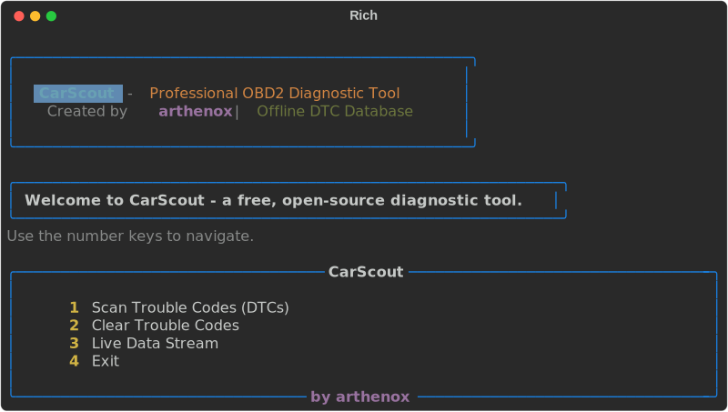
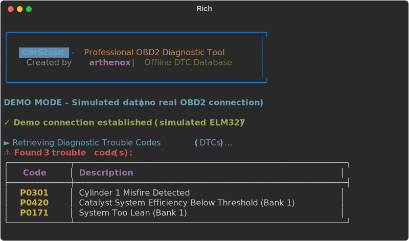
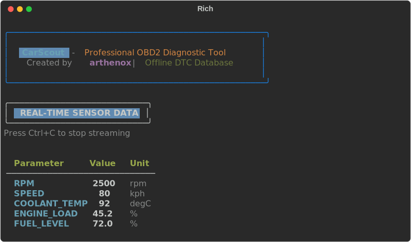
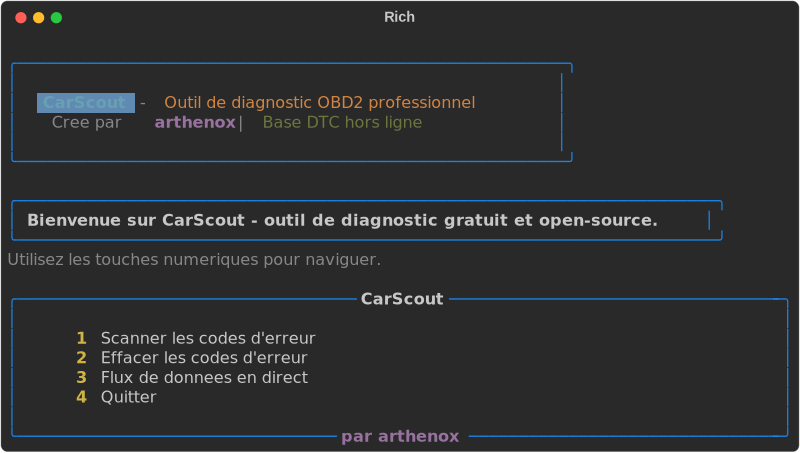
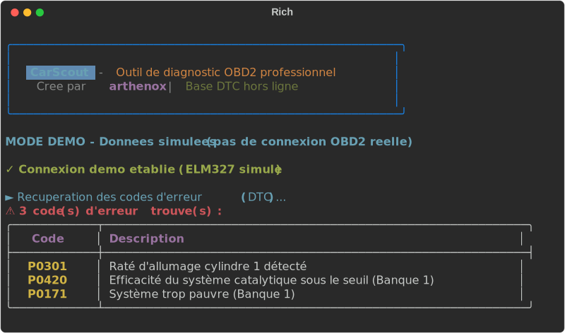
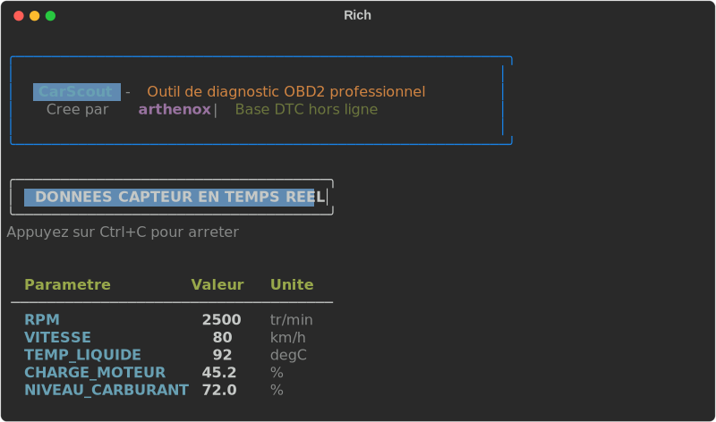

</h1>

<p align="center">
  <strong>Professional OBD2 Diagnostic Tool</strong><br/>
  <em>Scan, clear, and monitor your vehicle — right from the terminal.</em>
</p>

<p align="center">
  <a href="https://www.python.org/downloads/">
    
  </a>
  <a href="LICENSE">
    
  </a>
  <a href="https://www.elmelectronics.com/">
    
  </a>
  <a href="#">
    
  </a>
  <a href="#">
    
  </a>
  <a href="#">
    
  </a>
</p>

---

## ✨ Features

| Feature | Description |
|---------|-------------|
| 🔍 **Scan DTCs** | Read Diagnostic Trouble Codes with detailed descriptions from a local 2,972-code database |
| 🧹 **Clear DTCs** | Clear all stored trouble codes with a confirmation prompt for safety |
| 📊 **Live Data** | Stream real-time sensor data — RPM, speed, coolant temp, engine load, and more |
| 🌍 **Bilingual** | Full English and French interface (`--lang en` / `--lang fr`) |
| 📴 **Offline First** | All 2,972 DTC descriptions stored locally — no internet connection required |
| 🎨 **Rich TUI** | Professional terminal UI with colors, tables, progress bars, and panels |
| 🧪 **Demo Mode** | Test the full interface without real hardware (`--demo`) |
| 🔌 **USB & Bluetooth** | Supports ELM327 adapters via USB Serial and Bluetooth connections |
| 💻 **Multi-Platform** | Runs on Linux, Windows, and Android (Termux) |
| 📜 **Open Source** | GPL-2.0 licensed — free to use, modify, and distribute |

---

## 🎥 Demo


> The demo above shows:
> 1. Launching CarScout in demo mode (`--demo`)
> 2. The interactive main menu with four options
> 3. Scanning for trouble codes — discovering **P0301**, **P0420**, and **P0171**
> 4. Returning to the menu and clearing all codes
> 5. Real-time live data streaming with RPM, speed, and temperature

📺 **Full walkthrough video**: See [`carscout_demo.mp4`](carscout_demo.mp4) for a high-resolution recording. A YouTube video may also be available on the [arthenox channel](https://github.com/arthenox).

---

## 📦 Installation

### Linux / macOS

```bash
# Clone the repository
git clone https://github.com/arthenox/carscout.git
cd carscout

# (Optional) Create a virtual environment
python3 -m venv venv
source venv/bin/activate

# Install dependencies
pip install -r requirements.txt
```

### Windows

```powershell
# Clone the repository
git clone https://github.com/arthenox/carscout.git
cd carscout

# (Optional) Create a virtual environment
python -m venv venv
venv\Scripts\activate

# Install dependencies
pip install -r requirements.txt
```

### Android (Termux)

```bash
# Install Python
pkg install python

# Clone and install
git clone https://github.com/arthenox/carscout.git
cd carscout
pip install -r requirements.txt

# For Bluetooth ELM327, you may also need:
pkg install bluez
```

> **Note**: On Linux, you may need to add your user to the `dialout` group for serial port access:
> ```bash
> sudo usermod -aG dialout $USER
> ```
> Log out and back in for the change to take effect.

---

## 🚀 Usage

### Interactive Menu (Recommended)

```bash
# Launch with auto-detect ELM327 connection
python carscout.py

# Launch in demo mode (no hardware needed)
python carscout.py --demo

# French interface
python carscout.py --lang fr

# Demo mode with connection animation
python carscout.py --demo --delay
```

### Quick Commands

```bash
# Scan trouble codes directly
python carscout.py scan

# Clear trouble codes directly
python carscout.py clear

# Live data stream with custom PIDs
python carscout.py live --pids RPM SPEED COOLANT_TEMP ENGINE_LOAD

# Live data with custom update interval (0.5 seconds)
python carscout.py live --interval 0.5

# French interface — scan mode
python carscout.py scan --lang fr

# Demo mode — quick scan
python carscout.py scan --demo
```

### Command-Line Options

| Option | Description | Default |
|--------|-------------|---------|
| `command` | Subcommand: `menu`, `scan`, `clear`, `live` | `menu` |
| `--lang {en,fr}` | Interface language | `en` |
| `--demo` | Run in demo mode with simulated data | Off |
| `--delay` | Add artificial delays during connection (visual effect) | Off |
| `--pids` | Custom PIDs for live data (e.g., `RPM SPEED COOLANT_TEMP`) | `RPM SPEED COOLANT_TEMP` |
| `--interval` | Live data update interval in seconds | `1.0` |

---

## 🖼️ Screenshots

### English Interface

| Main Menu | DTC Scan | Live Data |
|-----------|----------|-----------|
|  |  |  |

### French Interface

| Menu Principal | Scan DTC | Données en Direct |
|----------------|----------|-------------------|
|  |  |  |

---

## 🧰 Requirements

- **Python 3.9+** — [Download Python](https://www.python.org/downloads/)
- **ELM327 OBD2 Adapter** — USB Serial or Bluetooth
  - USB: typically appears as `/dev/ttyUSB0` (Linux) or `COM3` (Windows)
  - Bluetooth: paired as `/dev/rfcomm0` (Linux) or `COM3+` (Windows)
- **OBD2-compatible vehicle** — 1996+ (US), 2001+ (EU), 2008+ (AU)

### Python Dependencies

| Package | Version | Purpose |
|---------|---------|---------|
| `python-obd` | >= 0.7.0 | OBD2 protocol communication |
| `rich` | >= 13.0.0 | Terminal UI (colors, tables, progress) |
| `pyserial` | >= 3.5 | Serial port communication |
| `pint` | >= 0.24 | Unit conversion (python-obd dependency) |

---

## 🚗 VAG-Specific DTC Database

The `dtc_db_vag.json` file contains 771 manufacturer-specific DTC codes for Volkswagen Auto Group (VW, Audi, SEAT, Skoda). These `P16xxx` codes are not part of the SAE J2012 standard and will only appear on VAG vehicles. They are loaded automatically when scanning a VAG-compatible ECU.

---

## 🧪 Testing

CarScout includes 34 unit tests covering core functionality:

```bash
# Run all tests
python -m pytest tests/ -v

# Run with coverage report
pip install pytest-cov
python -m pytest tests/ --cov=carscout --cov-report=term-missing
```

---

## 🤝 Contributing

Contributions are welcome! Whether you want to fix a bug, add a feature, or improve translations — we appreciate your help.

Please read the [Contributing Guide](CONTRIBUTING.md) for details on:

- How to fork and clone the repository
- Coding standards and commit message conventions
- How to submit a pull request
- How to run the test suite

---

## 📜 License

This project is licensed under the GNU General Public License v2.0 — see the [LICENSE](LICENSE) file for details.

---

## ⚠️ Disclaimer

**Use this tool only on vehicles you own or have explicit permission to diagnose.**

CarScout is provided for educational and diagnostic purposes only. The author is not responsible for any misuse, damage to vehicles, or injury resulting from the use of this software. Always exercise caution when working with vehicle diagnostic systems, and never attempt to clear codes or modify vehicle behavior while driving.

---

## 💬 Contact & Support

- **Author**: [arthenox](https://github.com/arthenox)
- **Issues**: [GitHub Issues](https://github.com/arthenox/carscout/issues)
- **Security**: See [SECURITY.md](SECURITY.md) for vulnerability reporting

---

<p align="center">
  Made with ❤️ and Python
</p>
